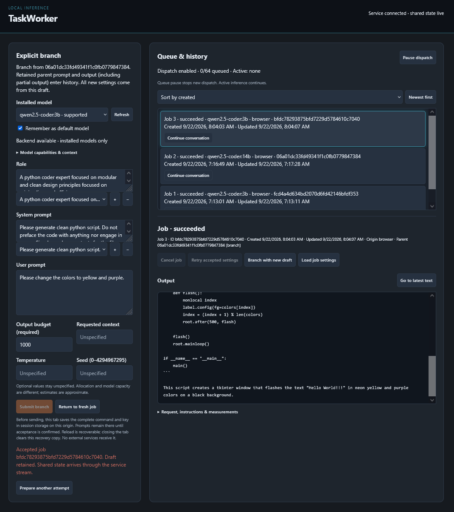

# TaskWorker

[](https://github.com/jacobmentalconstruct/TaskWORKER/actions/workflows/ci.yml)
[](LICENSE)
[](https://ollama.com)

A small local inference worker that people and agents share. One running service
owns a queue of jobs and their results; the browser UI, the command line, a Python
client and an MCP bridge for agents all watch and control **the same jobs**.
Inference is done by [Ollama](https://ollama.com) with models you already have
installed. Nothing is downloaded, no model weights are bundled, and nothing leaves
your machine.

<p align="center">
  
</p>

- Submit a prompt with an optional role and system prompt; every job starts with
  fresh input and sees no other job's output. Branching from a finished job is
  explicit, and each retained job in the browser carries a one-click **Continue
  conversation** action that starts one.
- Watch output stream live, cancel a running job (partial output is kept), retry,
  branch, pause and resume the queue.
- Accepted work outlives clients: closing a browser, script or agent never cancels
  it, and jobs are stored on disk. A job that was running when the service stopped
  is marked *interrupted*, never silently restarted.
- Safe resubmission: every create carries your idempotency key, so a lost reply
  can be resent and resolves to the original job.

## Requirements

- **Ollama 0.18.3.** Generation is supported only on this audited version and on
  installed text models that use a plain template (no vision, custom renderer or
  stored messages). Other Ollama versions are reported as `unsupported` rather
  than guessed at. Install a matching Ollama yourself; TaskWorker never downloads
  or manages models.
- Windows, macOS or Linux, on amd64 or arm64. Windows arm64 and macOS on Intel
  have not been executed; the [known limitations](docs/limitations.md) say exactly
  what has. Please report what you find (see Reporting problems below).
- Optional: Python 3.10 to 3.14 for the Python client (standard library only).

The executable is about 10 MB and has no runtime dependencies. Measured on one
Windows 10 amd64 machine, an idle service uses about 47 MiB of memory and no
measurable CPU, and starts in under half a second ([details](docs/development.md#measured-footprint)).

## Quick start

1. Download the archive for your platform from the release page and extract it.
   The executables are unsigned and not notarized, so Windows SmartScreen or macOS
   Gatekeeper may ask you to confirm before the first run. Check the download
   against `SHA256SUMS`.
2. Start the service and leave it running:

   ```text
   taskworker serve
   ```

   It listens on `http://127.0.0.1:7433` and stores jobs under your user
   configuration directory (`%AppData%\taskworker\data` on Windows,
   `~/Library/Application Support/taskworker/data` on macOS,
   `~/.config/taskworker/data` on Linux). Use `--server`, `--data-dir` and
   `--ollama` to change the address, storage and Ollama location. Only one
   service can use a data directory at a time.
3. Open **http://127.0.0.1:7433** in a browser to submit and watch jobs.
4. Or use the command line. Save this as `job.json`. Pick a model from
   `taskworker models` whose `text_generation` capability is true (unsupported
   installed models are listed too), and make the `idempotency_key` unique for
   each new job:

   ```json
   {"idempotency_key":"hello-001","request":{"model":"qwen2.5:0.5b","role":"Be concise.","prompt":"Say hello.","options":{"max_output_tokens":64}}}
   ```

   ```text
   taskworker submit --command job.json --wait --timeout 2m
   ```

   All client output is JSON. See [HTTP and CLI](docs/http.md) for every command,
   the exit codes and the reconnect rules.

## Use it from Python or an agent

- [Python client](docs/python.md): `pip install ./clients/python` (or add
  `clients/python/src` to `PYTHONPATH`). Standard library only, with idempotent
  creates, bounded waiting and reconnecting event streams.
- [MCP bridge](docs/mcp.md): point your MCP host at `taskworker mcp`. It is a
  client of the running service: it never starts a service or runs inference, and
  a missing service is a clear connection error.

More: [browser controls and local recovery](docs/ui.md),
[Ollama compatibility and limits](docs/ollama.md),
[behavioral contracts](docs/contracts.md), [persistence and recovery](docs/persistence.md).

## Security and known limitations

<!-- limitations:begin (generated by scripts/limitations.py from release/limitations.json; do not edit) -->

- **Ollama 0.18.3 only.** Generation is supported only on Ollama 0.18.3, the audited version, and on installed text models that use a plain template (no vision, custom renderer or stored messages). Any other Ollama version is reported as `unsupported` rather than guessed at. TaskWorker never downloads or manages models.
- **No authentication.** The service accepts loopback connections only and has no authentication: any program running as any user on the same machine can control it. Do not expose it to a network. Browser requests are restricted to the exact local origin.
- **Unencrypted storage.** Jobs, prompts and outputs are stored unencrypted in the data directory.
- **One job at a time, bounded queue.** One job runs at a time and the pending queue is bounded (a full queue returns `queue_full`). Retention is finite and there is no compaction.
- **Power-loss durability is untested.** Records are synced to disk before they are acknowledged, and a job that was running when the service stopped or crashed is marked interrupted. True power-loss durability depends on your filesystem and device, and power-loss testing has not been done.
- **Estimates and cancellation timing.** Token counts shown before a run are labelled estimates. Cancellation takes effect when Ollama stops the generation, so its exact timing is not guaranteed.
- **Unsigned executables.** The executables are not code-signed or notarized, so Windows SmartScreen or macOS Gatekeeper may ask you to confirm before the first run. Check each download against `SHA256SUMS`.
- **Windows arm64 and macOS on Intel have not been executed.** The packaged release binary was executed (version, help, serve, the embedded UI, the packaged Python client, the MCP bridge and a graceful stop) on Windows amd64, Linux amd64, Linux arm64 and macOS arm64: on Windows 10 and on Ubuntu under WSL2 by the maintainer, and on GitHub Actions runners for all four. The Windows arm64 and macOS amd64 (Intel) executables are cross-compiled and header-inspected only.
- **MCP verified with SDK clients only.** The MCP bridge is verified against the official Go and Python SDK clients. No specific agent host has been tried.

How each limit is tracked and closed: [docs/limitations.md](docs/limitations.md).

<!-- limitations:end -->

## Reporting problems

Bugs, questions and reports from platforms we could not test go on the project's
GitHub issue tracker. Please include the TaskWorker version (`taskworker version`),
your operating system and architecture, the Ollama version, what you did and what
happened, and the output of `taskworker health`. Prompts and outputs are stored
unencrypted, so leave out anything you would not want public.

For a security problem, do not open a public issue. Use the repository's Security
tab and choose *Report a vulnerability*, which is private to the maintainer.

The [development guide](docs/development.md) has the build, verification and
packaging details and the full list of what has and has not been tested.

## License

[MIT](LICENSE). The executable also contains the Go runtime and the vendored MCP
SDK and its dependencies, whose licenses are in `THIRD_PARTY_LICENSES.txt`.
